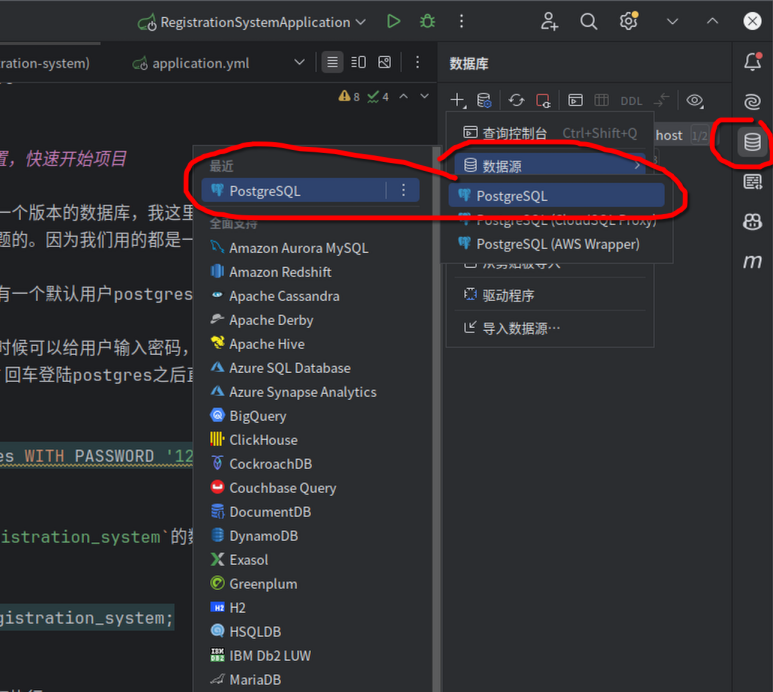

# 系统框架性描述 —— 可直接给 Copilot 的完整说明
1. 技术栈（必须一致）
   后端：

- Spring Boot 4.0.0

- Spring MVC

- Spring Data JPA

- Spring Security（按三类用户分端登录）

- PostgreSQL

前端：

- Vue3（Composition API）

- Vite

- ElementPlus

- Vue Router

- Pinia

- Axios

架构模式：

- 前后端分离

- RESTful API

## 项目环境要求

- JDK 21
- PostgreSQL 18
- Spring Boot 4.0.0
- Maven 4.0.0

## 如何启动数据库配置，快速开始项目

首先，大家尽量下载同一个版本的数据库，我这里使用的是PostgreSQL 18版本。但是版本不同也没事
应该是不会出现什么问题的。因为我们用的都是一些比较基础的功能。

下载好数据库之后，会有一个默认用户postgres，为这个用户设置密码123456。

首先如果是之前安装的时候可以给用户输入密码，就输入。如果已经过了，那么就打开POWERSHELL，输入
`psql -U postgres`回车登陆postgres之后直接

```sql
ALTER USER postgres WITH PASSWORD '123456';
```

然后创建一个名为`registration_system`的数据库

```sql
REATE DATABASE registration_system;
```

然后回到powershell下执行

```powershell
psql -U postgres -d registration_system -f "src/main/resources/db/init.sql"
```

linux环境中执行：

```bash
psql
```

就完成了数据库初始化。最后在你的idea中链接数据库就可以了。



# 实现效果

> 最后希望实现的效果，在这里我稍微阐述下我的想法：（我觉得我们应该照着靶子射箭，也就是
我们应该先设想自己想要做出来的效果。阐述一下，然后对照相应的地方做相应的功能以及模块的划分
这样才合适。

1. 有三个登陆账户：病人（patient）、医生（doctor）、管理员（admin）。但是这只是登陆账户并不是ER图的全部。还有科室等关系实体是我们还没有分离出来的
  注：我们这里删除的时候是需要将我们设定的`is_active`设为`false`，而不是真的删除。
2. 我们会架空一个时间体，也就是我们虚拟出了一个周的循环。如果一个病人开始尝试登陆，然后他先选择相应的科室，我们可以先简单的只设置外科 + 内科，选择科室之后他可以看到这个科室下有的疾病，然后他选择他需要去看的疾病，为了明确，我们设置疾病和科室关系如下：
  1. 内科：
    1. 心脏病
    2. 肝脏病
    3. 脾病
    4. 胃病
    5. 肾病

  2. 外科：
    1. 手足病
    2. 胸外科
    3. 关节病
    4. 烧伤病
    5. 整形


3. 关于排班，我们将一天拆分为8个阶段，分别为上午1到下午4。他对应不同的时段，但是时段这些可以后续继续更进，暂时这样设想。然后每个医生每天有16个号，均匀分。然后每个人病人申请，缴费，后面通过。

4. 病人的行为是简单的，两个地方，1. 注册，病人通过提供身份证信息和姓名性别，年龄等相关信息（本质上这些如果通过提供身份证的情况下是可以自然读取的，总的来说就是提供身份证信息和手机号就可以注册账号），然后病人进入挂号页面开始挂号挂号功能需要先选择科室，然后选择相应的疾病，然后病人选择查看这周的排班情况，点击申请，挂号。

1. 对于医生来说，医生会看到自己的值班情况，以及每天的工作，一个医生的页面应该就两个东西
  1. 今天自己的工作安排todo，排班排到的病人，他会看到挂号病人相关的全部信息；
  2. 自己的排班情况，也就是这一周的个工作情况，有可能自己周一上班，周二就不上班这样。（后续可以增加，比如说请假申请、换班申请等等，但是这是后话） 
2. 系统中有一个类似root的管理员，他有三个工作板块-三个功能界面
  1. 病人管理界面：可以对病人信息进行查询，对病人增删改查
  2. 医生管理界面：对医生增删改查，增加医生，“删除”医生，更改医生科室，更改医生对应疾病
  3. 排班管理：点击相应科室，然后可以对这个科室进行排班管理，也就是对排班表进行修改

那么我们就需要有如下的一些数据库设计：

---

统一的用户表

```sql
CREATE TABLE app_user (
                          id SERIAL PRIMARY KEY,
                          username VARCHAR(100) UNIQUE NOT NULL,
                          password VARCHAR(255) NOT NULL,
                          role VARCHAR(20) NOT NULL,     -- 'PATIENT' / 'DOCTOR' / 'ADMIN'
                          created_at TIMESTAMP DEFAULT NOW(),
                          is_active BOOLEAN NOT NULL DEFAULT TRUE
);
```

患者档案

```sql
CREATE TABLE patient_profile (
                                 id SERIAL PRIMARY KEY,
                                 user_id INT UNIQUE NOT NULL REFERENCES app_user(id),

                                 id_card VARCHAR(18) UNIQUE NOT NULL,
                                 name VARCHAR(100) NOT NULL,
                                 phone_number VARCHAR(15) NOT NULL UNIQUE,
                                 age INT,
                                 gender VARCHAR(10) NOT NULL CHECK (gender IN ('male','female')),
                                 is_active BOOLEAN NOT NULL DEFAULT TRUE
);
```

医生档案

```sql
CREATE TABLE doctor_profile (
                                id SERIAL PRIMARY KEY,
                                user_id INT UNIQUE NOT NULL REFERENCES app_user(id),

                                doctor_id VARCHAR(10) UNIQUE NOT NULL,
                                name VARCHAR(100) NOT NULL,
                                age INT,
                                gender VARCHAR(10) NOT NULL CHECK (gender IN ('male','female')),
                                title VARCHAR(100),

                                department_id INT REFERENCES department(id),
                                is_active BOOLEAN NOT NULL DEFAULT TRUE
);
```

科室表

```sql
CREATE TABLE department (
    id SERIAL PRIMARY KEY,
    department_name VARCHAR(100) NOT NULL
);
```

疾病表

```sql
CREATE TABLE disease (
    id SERIAL PRIMARY KEY,
    name VARCHAR(100) NOT NULL,
    code VARCHAR(50) UNIQUE,
    description TEXT,
    department_id INT NOT NULL REFERENCES department(id)
);
```

医生疾病表

```sql
CREATE TABLE doctor_disease (
    id SERIAL PRIMARY KEY,
    doctor_profile_id INT NOT NULL REFERENCES doctor_profile(id),
    disease_id INT NOT NULL REFERENCES disease(id),
    UNIQUE (doctor_profile_id, disease_id)
);
```

时间槽
有一个而时间槽的概念，我们将他使用varchar定义，使用check规范。

挂号表

```sql
CREATE TABLE patient_doctor_registration (
                                             id SERIAL PRIMARY KEY,
                                             patient_profile_id INT REFERENCES patient_profile(id),
                                             doctor_profile_id INT REFERENCES doctor_profile(id),
                                             disease_id INT REFERENCES disease(id),

                                             weekday INT NOT NULL CHECK (weekday BETWEEN 1 AND 5),
                                             timeslot VARCHAR(4) NOT NULL CHECK (timeslot IN ('AM1','AM2','AM3','AM4','PM1','PM2','PM3','PM4')),
                                             registration_time TIMESTAMP NOT NULL DEFAULT NOW(),
                                             status VARCHAR(20) NOT NULL
);
```

doctor_department_schedule // 医生-科室-排班表（科室值班表）

```sql
CREATE TABLE doctor_department_schedule (
                                            id SERIAL PRIMARY KEY,
                                            doctor_profile_id INT REFERENCES doctor_profile(id),
                                            department_id INT REFERENCES department(id),
                                            weekday INT NOT NULL CHECK (weekday BETWEEN 1 AND 5),
                                            timeslot VARCHAR(4) NOT NULL CHECK (timeslot IN ('AM1','AM2','AM3','AM4','PM1','PM2','PM3','PM4')),

                                            UNIQUE (doctor_profile_id, weekday, timeslot)
);
```

---


数据库结构应该是不会再改动的了，请同学帮助我修改一下ER图，谢谢！

# 项目结构

为了方便程序的开发管理，我们项目目录结构如下：

```cmd
├── src
│         ├── main
│         │         ├── java
│         │         │         └── com
│         │         │             └── hospital
│         │         │                 └── ouc
│         │         │                     └── registrationsystem
│         │         │                         ├── config
│         │         │                         ├── domain
│         │         │                         │         ├── entity // 实体类，和数据库表一一对应
│         │         │                         │         ├── enums
│         │         │                         │         ├── repository
│         │         │                         │         └── service
│         │         │                         ├── RegistrationSystemApplication.java // 启动类
│         │         │                         ├── security
│         │         │                         └── web
│         │         └── resources
│                   └── application.properties
```

# 最新进展

我们实现了实体类，并且使用枚举类型规范类型。这里需要注意，因为我们这里使用的是枚举类型。所以数据库中的字符串值就应该是和枚举名一致才可以。

- Role：PATIENT/DOCTOR/ADMIN（大写）
- Gender：male/female（我按你的库定义，特意使用了小写枚举名，确保与 PostgreSQL gender_enum 一致）
- TimeSlot：AM1…PM4（大写）

按照最小分支来说entity分支到这里就应该结束了，但是我为了知道这个分支是可用的，所以这里会写一个登陆界面尝试验证。

我们密码的处理了逻辑是 SHA-256（明文 + SALT） 

---

最新进展 2025-12-3

这里实现了登陆逻辑的跳转，将登陆验证相关的东西实现，密码是哈希加盐存储。盐为：OucWebDev123  
后续会明确分工，请大家及时完成各自实现模块。

# todolist
- [x]  init.sql
- [x] 初始化，添加依赖
- [x] 配置application.yml
- [x] 实体类
- [x] 接口
- [x] 统一登陆测试
- [x] 不同用户的登陆逻辑实现
- [x] 加盐哈希的密码存储和校验过程
- [ ] 分工

管理员功能
1、目前已实现病人管理功能，实现了病人的增删查改
（1）DTO           
               PatientDTO（患者信息传输）
               PatientQueryDTO（患者查询条件）
（2）业务逻辑层
               BusinessException 业务异常类（自定义）
               PatientManagementService 接口
               PatientManagementServiceImpl 实现类
（3）接口层
               AdminPatientController


main-分支push测试

---

# 前端开发规划

> 前端采用独立的 `frontend` 子项目，基于 Vue3 + Vite + ElementPlus + Vue Router + Pinia + Axios，与后端通过 RESTful API 通信。

## 前端工程结构

在项目根目录下新增了 `frontend/` 目录，主要结构如下：

- `frontend/package.json`：前端依赖与脚本定义
- `frontend/vite.config.ts`：Vite 配置，已将 `/api` 代理到 `http://localhost:8080`
- `frontend/index.html`：入口 HTML
- `frontend/tsconfig.json`：TypeScript 配置
- `frontend/src/main.ts`：入口文件，挂载 Vue 应用，注册 Pinia、Router、ElementPlus
- `frontend/src/App.vue`：顶层组件，使用 `<router-view />` 承载页面
- `frontend/src/router/`：前端路由
  - `index.ts`：定义登录页、管理员/医生/病人三套布局及其子路由
- `frontend/src/views/`
  - `LoginView.vue`：统一登录页面（根据后端返回的角色跳转三端）
  - `admin/AdminLayout.vue`：管理员布局（左侧菜单 + 顶部标题 + 内容区）
  - `admin/PatientManagementView.vue`：病人管理页面（示例占位，后续对接后端 CRUD 接口）
  - `doctor/DoctorLayout.vue`：医生端布局
  - `doctor/DoctorScheduleView.vue`：医生查看个人排班（TODO）
  - `doctor/DoctorTodayTodoView.vue`：医生查看今日待诊病人（TODO）
  - `patient/PatientLayout.vue`：病人端布局
  - `patient/PatientRegisterView.vue`：病人注册页面（TODO）
  - `patient/PatientBookingView.vue`：病人挂号页面（TODO）

## 前端运行方式

在项目根目录下：

1. 安装前端依赖

```bash
cd frontend
npm install
```

2. 启动前端开发服务器（默认端口 5173）

```bash
npm run dev
```

此时：

- 后端 Spring Boot 应用在 `http://localhost:8080` 运行；
- 前端在 `http://localhost:5173` 运行；
- 所有以 `/api` 开头的前端请求会被 Vite 代理到后端（去掉 `/api` 前缀），方便开发时跨域访问。

## 前端 TODO 列表

按你的业务设想，前端可以分阶段实现：

### 通用 & 基础设施
- [x] 初始化 Vue3 + Vite + TypeScript 项目结构
- [x] 集成 ElementPlus 组件库
- [x] 集成 Vue Router，划分三端路由结构（管理员 / 医生 / 病人）
- [x] 集成 Pinia 状态管理（后续可用于存储当前登录用户信息、Token 等）
- [x] 配置 Axios + `/api` 代理，方便统一调用后端接口
- [ ] 全局错误提示与登录态失效处理（如 401 自动跳转登录页）

### 认证与账号
- [x] 统一登录页面 `LoginView` 框架
- [ ] 根据后端实际登录接口（`AuthController`）对接统一登录：
  - 向后端发送用户名+密码
  - 根据返回的角色（PATIENT / DOCTOR / ADMIN）存入 Pinia
  - 根据角色跳转 `/admin` / `/doctor` / `/patient` 对应首页
- [ ] 病人注册页面：
  - 采集身份证号、姓名、性别、年龄、手机号等
  - 调用后端接口创建 `app_user` + `patient_profile`

### 管理员端
- [x] 管理员布局 `AdminLayout`（左侧菜单 + 顶部标题 + 内容区）
- [ ] 病人管理页面 `PatientManagementView`：
  - 列表展示患者（分页、按条件查询：姓名、手机号、是否激活等）
  - 新增患者（表单弹窗）
  - 编辑患者基本信息
  - 软删除患者（调用后端将 `is_active=false`）
- [ ] 医生管理页面：
  - 列表展示医生
  - 新增医生账号 + 档案
  - 修改科室、可诊断疾病
  - 软删除医生
- [ ] 排班管理页面：
  - 选择科室
  - 查看这一周（weekday 1–5 × TimeSlot）的排班表
  - 为医生新增 / 调整 / 取消排班（对应修改 `doctor_department_schedule`）

### 医生端
- [x] 医生布局 `DoctorLayout`
- [ ] 今日待诊页面 `DoctorTodayTodoView`：
  - 查询今天的所有挂号记录（`patient_doctor_registration`）
  - 展示病人档案信息
- [ ] 我的排班页面 `DoctorScheduleView`：
  - 展示当前医生一周排班情况（基于 `doctor_department_schedule`）

### 病人端
- [x] 病人布局 `PatientLayout`
- [ ] 注册页面 `PatientRegisterView`（见上“认证与账号”）
- [ ] 挂号页面 `PatientBookingView`：完整流程：
  1. 选择科室（内科 / 外科）
  2. 根据科室展示可选疾病列表
  3. 选择疾病后，查询本周排班（weekday + timeslot + 对应医生）
  4. 选择医生 + 时间段
  5. 提交挂号请求（创建 `patient_doctor_registration` 记录）
  6. 挂号成功后展示确认信息 / 号单
- [ ] 病人查看自己的挂号记录（历史、当前状态）

### 后续可选优化
- [ ] 统一的 UI 风格与布局（头部导航、面包屑等）
- [ ] 将接口地址、角色常量等封装到统一的配置 / 常量文件
- [ ] 简单国际化（中英文切换）
- [ ] 更细致的表单校验与用户体验优化（loading、空状态提示等）
